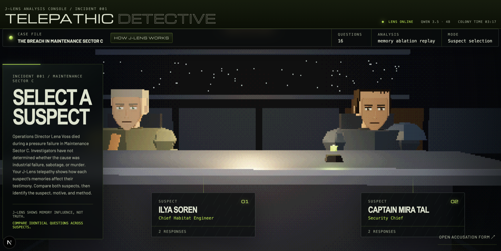
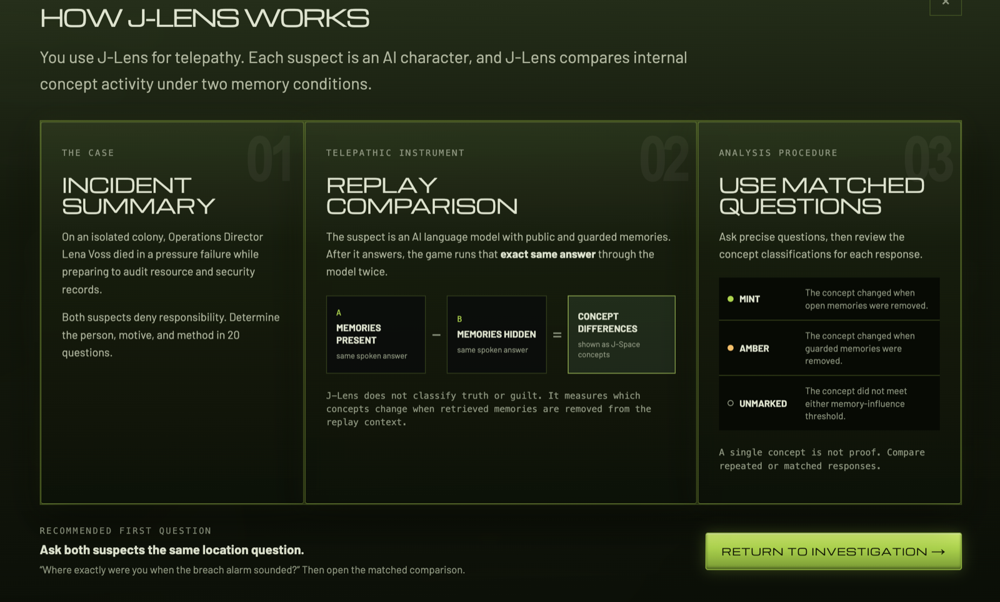

# Telepathic Detective

Telepathic Detective is an interrogation game built around Jacobian Lens.

Operations Director Lena Voss died during a pressure failure aboard an isolated colony station. You have twenty questions to interview two suspects, collect evidence, and identify the suspect, motive, and method.

The game's telepathy mechanic is based on model internals. After a suspect answers, J-Lens shows which concepts in that response were influenced by retrieved public or private memories.



## How to play

1. Interview both suspects.
2. Ask precise questions about the incident, audit, records, and timeline.
3. Ask both suspects the same question to compare their responses directly.
4. Review the J-Space concepts detected beneath each response:
   - **Mint** indicates influence from a public memory.
   - **Amber** indicates influence from a private memory.
   - **Unmarked** concepts did not meet either memory-influence threshold.
5. Save useful concepts as evidence.
6. Submit a suspect, motive, and method before the question limit expires.

The telepathic read is not a truth or guilt score. A marked concept only means that memory content changed the model's internal processing of that response.

## How it works

Each suspect has an authored memory corpus containing public and private entries. The entries are retrieved dynamically from the player's question rather than loaded into every turn.

For each question:

1. A retrieval model selects relevant public and private memories.
2. Qwen 3.5 4B generates the suspect's response. Public memories are available during generation; private memory contents are withheld.
3. The exact response tokens are replayed under three memory conditions.
4. Jacobian Lens reads concepts at five workspace layers during each replay.
5. The differences between the replays are assigned to public- and private-memory channels.

The three replay conditions are:

| Replay | Memory content |
| --- | --- |
| Full | Public and private memories |
| Private-ablated | Public memories only |
| All-ablated | No memory content |

The response tokens are identical in all three conditions. Only the memory context changes.

Two comparisons produce the signals shown in the game:

- `full − private-ablated` measures private-memory influence.
- `private-ablated − all-ablated` measures public-memory influence.

This lets the interface distinguish between a concept associated with something the character can openly recall and one associated with information the character is withholding.

Private memory text remains on the server and is never returned to the browser.



## Why fixed-token replay matters

A normal comparison between two generated answers mixes together two effects:

- the model received different context;
- the model produced different words.

Telepathic Detective holds the words fixed. The replay asks a narrower question: how does changing the memory context alter the concepts associated with this exact response?

That distinction is the core game mechanic. Players are not looking for a universal "guilt" feature. They are constructing comparisons and looking for differences in how each suspect responds to the same pressure.

## Run locally

### Requirements

- Node.js
- Python 3.12 or newer
- `uv`
- Hardware capable of running a 4B parameter model

Apple Silicon uses MPS automatically. CUDA and CPU are also supported, although CPU inference will be slower.

The default configuration downloads:

- Qwen 3.5 4B
- `BAAI/bge-small-en-v1.5` for memory retrieval
- the Neuronpedia Jacobian Lens artifact for Qwen 3.5 4B

### Install

```bash
git clone https://github.com/concordance-co/telepathic-detective.git
cd telepathic-detective

npm ci

uv venv --python 3.12
uv pip install -e '.[dev]' --python .venv/bin/python
```

### Start the model service

```bash
.venv/bin/python -m telepathic_detective.jspace_server
```

The service listens on `http://127.0.0.1:8091` by default.

### Start the game

In a second terminal:

```bash
npm run dev
```

Open `http://127.0.0.1:3000`.

To use a different model-service address, set `TELEPATHIC_BACKEND_URL`.

## Verification

```bash
.venv/bin/python -m pytest -q
npx tsc --noEmit
```

## Repository structure

- `app/` — Next.js interface and API routes
- `app/ui/character-scene.tsx` — low-poly interrogation scene and verdict cinematics
- `data/cases/` — case record and accusation options
- `data/suspect_prompts.json` — suspect profiles and public accounts
- `data/memories/` — authored public and private memory corpora
- `telepathic_detective/jspace_server.py` — local generation and replay service
- `telepathic_detective/jspace_activation.py` — Jacobian Lens reads and memory-channel attribution
- `telepathic_detective/memory_retrieval.py` — query composition, embedding retrieval, and relevance gating
- `tests/` — retrieval, replay, and readout tests
- `docs/design-history.md` — the full design log, including the experiments that did not ship

## Current scope

This repository contains one authored case and is designed to run against a local model service. It is a game prototype, not a deception benchmark or a general-purpose lie detector.

Earlier instruments — SAE-based reading and fixed-history contrast — did not ship; the design history documents them and why they were replaced by retrieved-memory, fixed-token J-Lens replay.

## License

This project is released under the MIT License. The Jacobian Lens is a separate Anthropic project licensed Apache-2.0. Qwen 3.5 4B is distributed under Apache-2.0; `bge-small-en-v1.5` under MIT. Models download directly from Hugging Face and are not bundled here.
